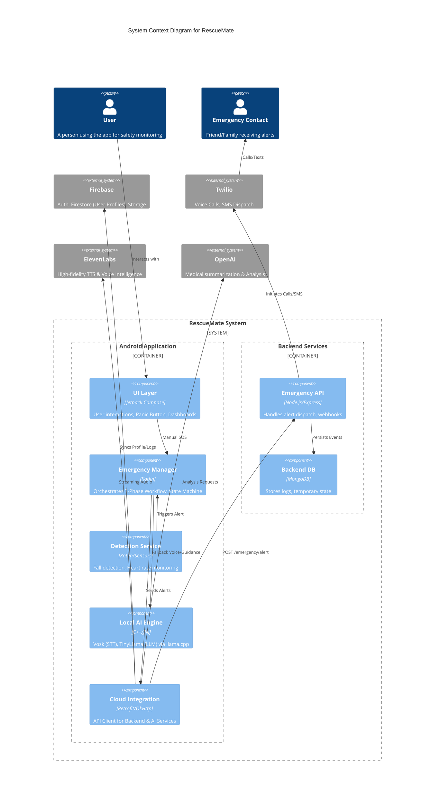

# RescueMate Architecture

RescueMate is designed as an **offline-first** emergency response application. It prioritizes local processing for critical features (emergency detection, basic voice assistance) while leveraging cloud services for high-fidelity interactions and reliable external communications when connectivity is available.

## System Architecture Diagram

## Core Data Flows

### 1. Emergency Trigger Workflow
1.  **Detection**: The `Detection Service` monitors sensor data (accelerometer, heart rate). If an anomaly is detected (or User presses SOS), an event is sent to `EmergencyManager`.
2.  **Orchestration**: `EmergencyManager` starts the 3-Phase workflow:
    *   **Phase 1**: Local countdown & UI prompt.
    *   **Phase 2**: If no user response, it calls `CloudIntegration` to notify the backend.
3.  **Dispatch**: The `Node.js Backend` receives the alert and instructs `Twilio` to call/text configured `Emergency Contacts`.

### 2. Hybrid AI Voice Assistance
*   **Online Mode**:
    *   User audio is streamed to **ElevenLabs** for low-latency, natural conversation.
    *   Transcripts are sent to **OpenAI** to generate a structured medical summary (e.g., "User reports chest pain").
*   **Offline Mode (Fallback)**:
    *   User audio is processed locally by **Vosk** (Speech-to-Text).
    *   Text is fed into **TinyLlama** (running via `llama.cpp` JNI bindings) to generate guidance.
    *   Response is synthesized locally or displayed on screen.

### 3. Data Synchronization
*   **User Profile**: Critical medical data (allergies, contacts) is synced from **Firebase Firestore** to an encrypted local database (`EncryptedSharedPreferences` / Room) at startup to ensure it's available offline.
*   **Logs**: Interaction logs and emergency event history are uploaded to Firestore for permanent record-keeping when the device is online.
